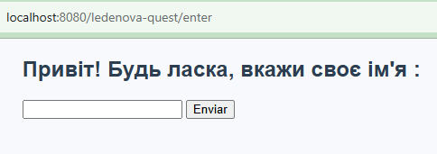
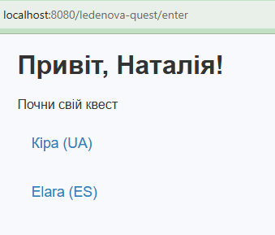
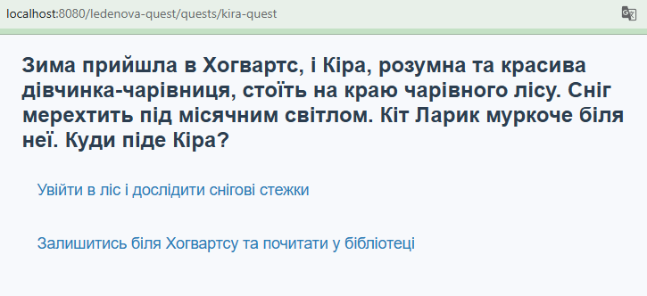
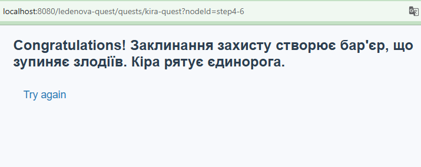

## System Requirements
- Tomcat 10.1
- Java 23

## Installation
1. Build war file
    > mvn clean install
2. Deploy `target/ledenova-quest.war` to your local Tomcat
3. Entry point: http://localhost:8080/ledenova-quest/enter

### Enter your name

### List of quests

### Quest start

### Quest end
